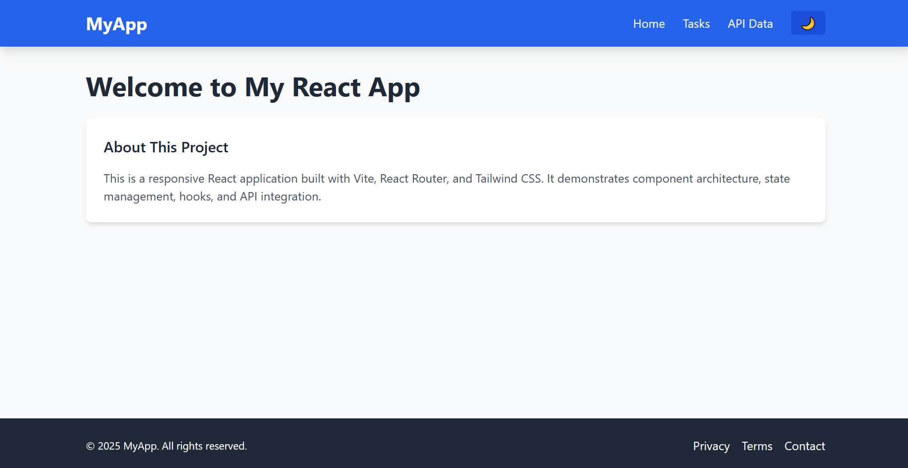
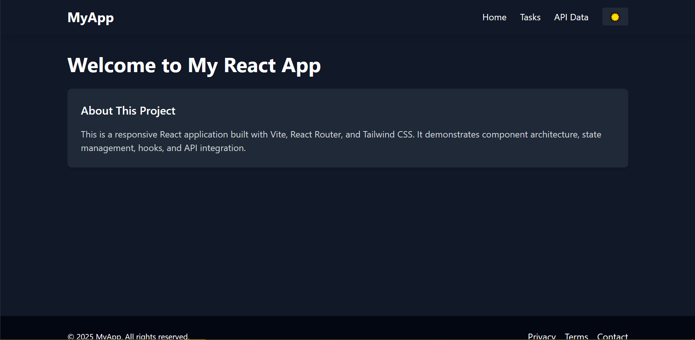
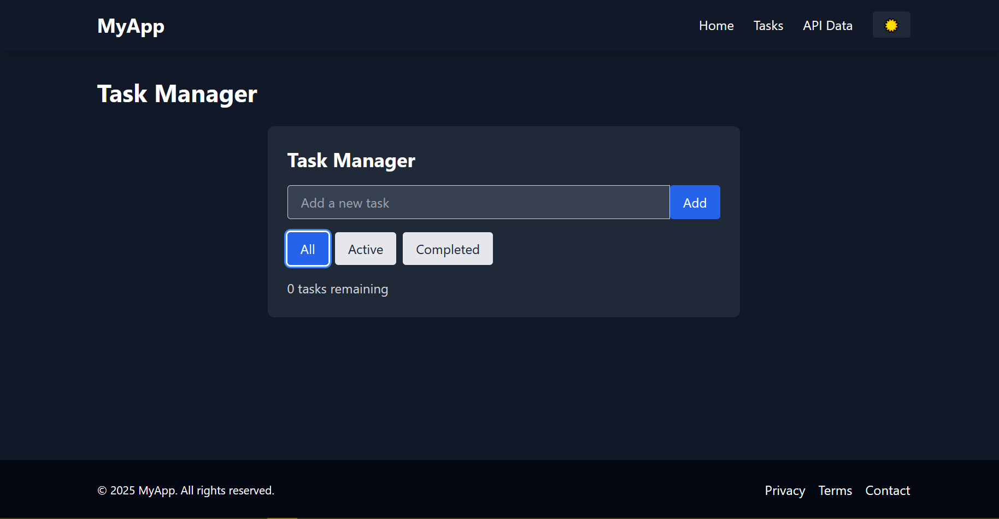

# 🎨 React.js, JSX, and Tailwind CSS – Mastering Front-End Development

A responsive React application demonstrating component architecture, state management, hooks usage, and API integration. Built with Vite, React Router, and Tailwind CSS.

## 🚀 Live Demo

Click the link below to view

   View Live Application:  https://harmonious-truffle-f1724c.netlify.app/
## 📸 Screenshots

### Home Page

*Welcome page showcasing the application overview and project description.*

### Tasks Page

*Task management interface with add, complete, and delete functionality.*

### API Data Page

*API integration page displaying fetched data with search and pagination.*

## 🛠️ Tech Stack

- **Frontend Framework:** React 18
- **Build Tool:** Vite
- **Styling:** Tailwind CSS
- **Routing:** React Router DOM
- **State Management:** React Hooks (useState, useEffect, useContext)
- **API Integration:** Fetch API
- **Deployment:** Vercel/Netlify

## 📂 Project Structure

```
src/
├── components/          # Reusable UI components
│   ├── Button.jsx       # Customizable button component
│   ├── Card.jsx         # Content display card
│   ├── Navbar.jsx       # Navigation component
│   ├── Footer.jsx       # Footer with links
│   ├── TaskManager.jsx  # Task management interface
│   └── ApiData.jsx      # API data display component
├── pages/              # Page components
│   ├── Home.jsx        # Landing page
│   ├── TasksPage.jsx   # Tasks management page
│   └── ApiDataPage.jsx # API data page
├── hooks/              # Custom React hooks
│   └── useLocalStorage.js # Local storage hook
├── context/            # React context providers
│   └── ThemeContext.jsx # Theme management (light/dark)
├── api/                # API integration
│   └── fetchPosts.js   # API data fetching functions
├── utils/              # Utility functions
│   └── formatDate.js   # Date formatting utilities
├── App.jsx             # Main application component
├── main.jsx            # Application entry point
└── index.css           # Global styles and Tailwind imports
```

## ✨ Features

### 🎯 Core Functionality
- **Responsive Design:** Mobile-first approach with Tailwind CSS
- **Theme Switching:** Light/Dark mode toggle with persistent storage
- **Task Management:** Add, complete, delete, and filter tasks
- **API Integration:** Fetch and display data from external APIs
- **Search & Filter:** Real-time search and filtering capabilities

### 🧩 Components
- **Button:** Multiple variants (primary, secondary, danger)
- **Card:** Flexible content containers
- **Navbar:** Responsive navigation with theme toggle
- **Footer:** Site footer with links and copyright
- **TaskManager:** Complete task CRUD operations
- **ApiData:** API data display with loading states

### 🔧 Technical Features
- **Custom Hooks:** `useLocalStorage` for data persistence
- **Context API:** Theme management across components
- **React Router:** Client-side routing
- **PropTypes:** Type checking for component props
- **Error Handling:** Graceful error states for API calls

## 🚀 Getting Started

### Prerequisites
- Node.js (v18 or higher)
- npm or yarn
- Git

### Installation

1. **Clone the repository:**
   ```bash
   git clone https://github.com/your-username/react-js-jsx-and-css-mastering-front-end-development-Erico432.git
   cd react-js-jsx-and-css-mastering-front-end-development-Erico432
   ```

2. **Install dependencies:**
   ```bash
   npm install
   ```

3. **Start development server:**
   ```bash
   npm run dev
   ```

4. **Open your browser:**
   Navigate to `http://localhost:5173`

### Build for Production

```bash
npm run build
```

The built files will be in the `dist/` directory, ready for deployment.

## 📱 Usage

### Navigation
- **Home:** Overview of the application
- **Tasks:** Manage your todo items
- **API Data:** View fetched data from external APIs

### Theme Toggle
Click the sun/moon icon in the navbar to switch between light and dark themes.

### Task Management
- Add new tasks using the input field
- Click the checkbox to mark tasks as complete
- Use the filter buttons to view All, Active, or Completed tasks
- Click the delete button to remove tasks

### API Data
- Browse paginated data from the API
- Use the search bar to filter results
- Loading states are displayed during data fetching

## 🔧 Configuration

### Environment Variables
Create a `.env` file in the root directory for environment-specific settings:

```env
VITE_API_BASE_URL=https://jsonplaceholder.typicode.com
```

### Tailwind CSS
Custom Tailwind configuration in `tailwind.config.js`:

```javascript
/** @type {import('tailwindcss').Config} */
export default {
  content: [
    "./index.html",
    "./src/**/*.{js,ts,jsx,tsx}",
  ],
  darkMode: 'class',
  theme: {
    extend: {},
  },
  plugins: [],
}
```

## 🧪 Testing

Run the development server and test the following:

1. **Responsive Design:** Resize browser window and check mobile/tablet layouts
2. **Theme Toggle:** Switch between light and dark modes
3. **Task Management:** Add, complete, and delete tasks
4. **API Integration:** Check loading states and error handling
5. **Navigation:** Test all routes and links

## 🚀 Deployment

### Option 1: Vercel (Recommended)
1. Push your code to GitHub
2. Connect your repository to [Vercel](https://vercel.com)
3. Deploy automatically on every push

### Option 2: Netlify
1. Build the project: `npm run build`
2. Drag and drop the `dist` folder to [Netlify](https://netlify.com)

### Option 3: GitHub Pages
1. Install gh-pages: `npm install --save-dev gh-pages`
2. Add deploy script to `package.json`
3. Run `npm run deploy`

## 🤝 Contributing

1. Fork the repository
2. Create a feature branch: `git checkout -b feature-name`
3. Commit changes: `git commit -am 'Add feature'`
4. Push to branch: `git push origin feature-name`
5. Submit a pull request
